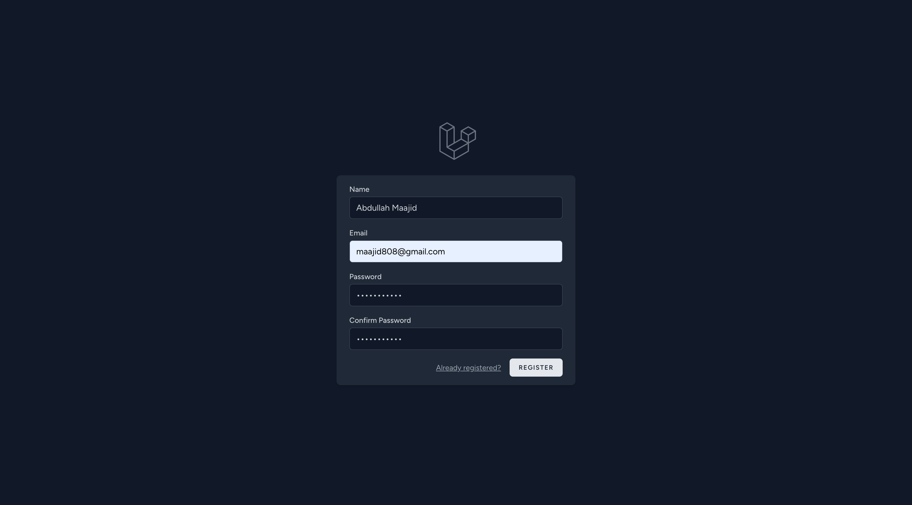
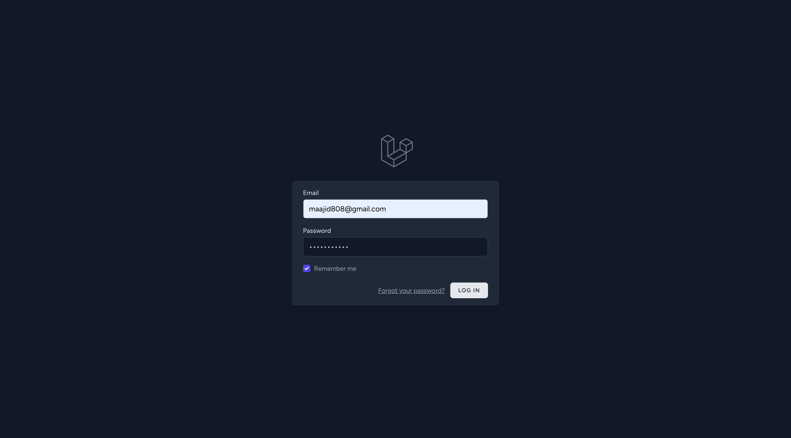
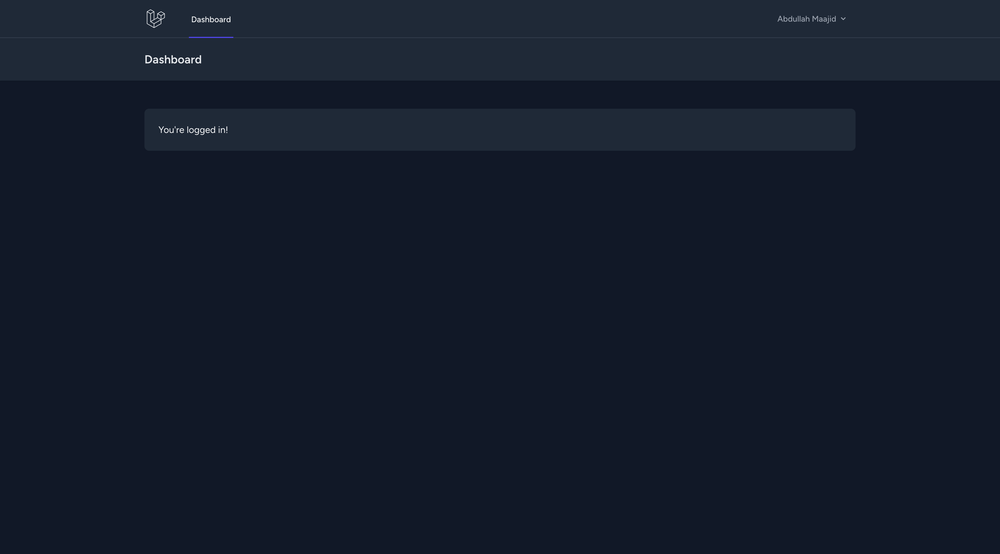
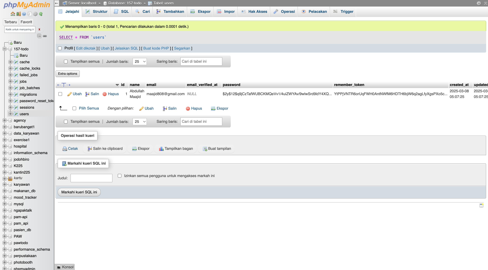
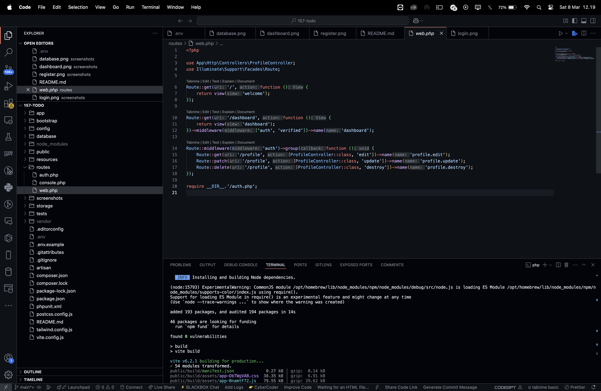

# 157-todo

Project Laravel untuk manajemen TODO sederhana.

## Screenshots

Berikut adalah tampilan aplikasi:

- **Instalasi**  
  

- **Halaman Registrasi**  
  

- **Halaman Login**  
  

- **Dashboard**  
  

- **Tampilan Database**  
  

- **Tampilan Code Web**  
  


## Instalasi

1. Clone repository ke dalam folder **157-todo**:
   ```bash
   git clone <repository-url> 157-todo
